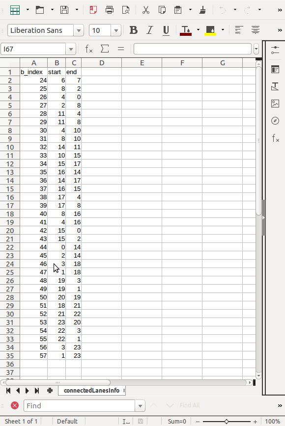
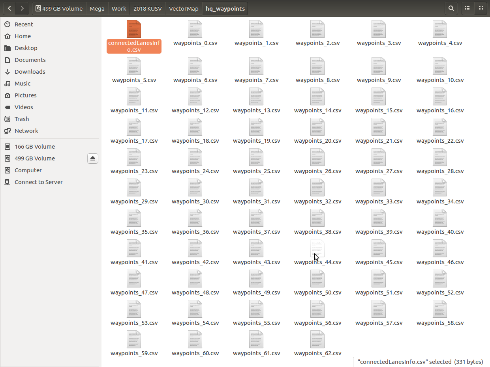

### SVMT Tool

The main file is SimpleVectorMapperTool.py.

The two preprocessing files are to generate Autoware-format waypoint files from latitude and longitute values.

#### Preparations 
Before we update the program, please prepare waypoint files naming with 'waypoints_[num].csv' where num starts from 0 to (1-num-lanes).

In the "main" part, please update the following
- num_lanes : number of waypoint files
- connectedLaneInfo_file : file name of connected lanes information (please check the file format in my paper)
- lane_status : prepare the lane status for each lane according to the lane type for connection 
  - status : 1 => loop (connect itself)
  - status : 2 => find nearest point from the first lane to connect with end point of the second lane 
  - status : 3 => find nearest point from the first lane to connect with first point of the second lane 
  - status : 4 => find nearest points from the first lane to connect with two end points of second lane
 
where the first lane means the just-newly constructed lane network, the second lane is the current index lane
(For example, if we have 5 waypoint files, assume the current index is 3. Then, the first lane means the lane network which includes waypoints_0, waypoints_1, and waypoints_2 files. 
  The second lane means waypoints_3 file.)
  
#### Example

Check the screenshots below, where we developed the vector map for our competition site in Daegu. There, we generated 63 waypoint files. Each waypoint file needs to be connected with one another. We prepared such lane connection information in connectedLaneInfo_file, where b_index is the current waypoint file index, start and end for to be connected with first and ended with, correspondingly. So, only waypoint files with lane_status 4 are required to prepare that connectedLaneInfo_file.

In the future, we can update connectedLaneInfo_file concept to be combined with lane_status so that the lane_status values need not be set.

#### Please cite this following [this paper](https://ieeexplore.ieee.org/abstract/document/8679340) if the code is useful to you!

